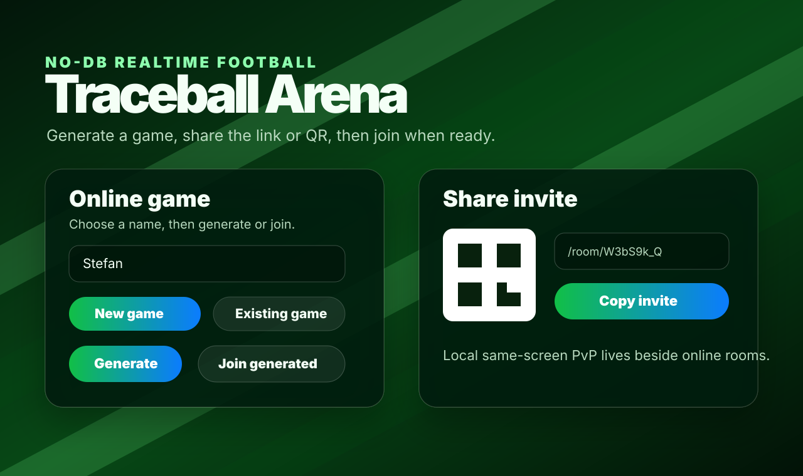
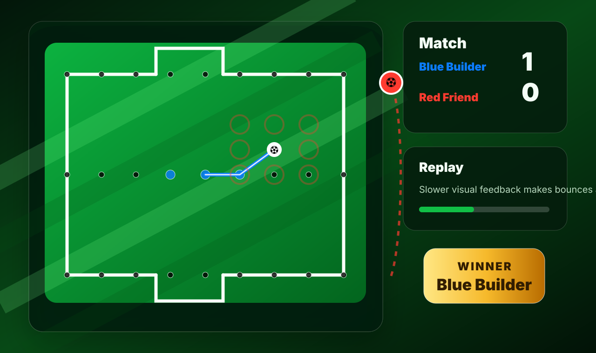

# Traceball Arena

A realtime browser game inspired by paper soccer / Trace Soccer. It started as a no-account WebSocket MVP and has evolved into a small shareable arena with online rooms, local same-screen play, mobile/tablet topology, replay, scorekeeping, and clearer game-state feedback.

Live app: https://traceball-arena-production.up.railway.app

## Screenshots





## What it does

- Create a room and share a link or QR code.
- Friend joins from the link, chooses a name, and the match starts through WebSockets.
- Local same-screen PvP for two players on one device, without room creation or sockets.
- 8-direction movement with no repeated segments.
- Bounce/continue turns from already visited points and boundary points.
- Goals, own goals, stuck-loss detection, cumulative room/local score, and new-round reset.
- Client-side replay controls live with the board. No accounts and no persistent database.
- Responsive layout: desktop uses a board + match side panel; phones/tablets use Home / Play / Match tabs.

## Gameplay

Traceball is a turn-based grid football game:

- The ball starts at midfield.
- On your turn, move one point in any of 8 directions: up, down, left, right, or diagonally.
- A traced segment cannot be used twice in either direction.
- Landing on a fresh point usually passes the turn to the other player.
- Landing on a previously visited point or a boundary point gives a bounce, so the same player continues.
- Entering the opponent gate scores and ends the round.
- Entering your own gate is an own goal and gives the round to the opponent.
- If the player to move has no legal move, they are stuck and lose the round.

Visual feedback:

- Legal move circles are dimmed and use the current player color instead of generic yellow.
- The turn marker ball sits next to the current player's home gate.
- When the turn changes, the marker jumps across the board and changes color as it reaches the next gate.
- Winner state appears as a golden overlay with confetti at the winner's own gate.

## Technologies

- **Runtime:** Node.js
- **Server:** Express static/app shell server
- **Realtime:** `ws` WebSocket rooms with in-memory room state
- **IDs:** `nanoid` room codes
- **QR:** `qrcode` endpoint for invite links
- **Frontend:** vanilla HTML/CSS/JavaScript canvas renderer
- **PWA:** manifest + service worker app-shell cache with forced refresh on updates
- **Tests:** Vitest rule/state tests plus static build checks for UI and deployment contracts
- **Deployment:** Railway single-service Node app using `railway.json`

## Game-dev evolution

The project grew through small playable slices:

1. **Core realtime MVP** — room creation, invite links, QR code, two WebSocket players, and canonical server-side game state.
2. **Rules and replay** — 8-direction legal moves, visited/boundary bounce rules, goals, own goals, stuck-loss detection, and move replay.
3. **Mobile playability** — board aspect-ratio constraints, mobile/tablet Home / Play / Match tabs, replay controls beside the board, and service worker cache refreshes.
4. **Robust room lifecycle** — watcher sockets for invite pages, stable client IDs, reconnect/rejoin handling for mobile/PWA lifecycle events, and guarded mutating actions.
5. **Local same-screen mode** — client-side local PvP with the same state shape as online rooms, cumulative score preservation, static face-to-face board, and no WebSocket slot consumption.
6. **Game polish** — gate labels, score strip, winner modal, gate confetti, player-colored move hints, slower result animation, and a jumping turn marker.

The implementation intentionally stays no-DB for now: rooms, scores, and replays are in memory and disappear when the Railway service restarts.

## Local development

```bash
npm install
npm run dev
```

Open http://localhost:3000.

Useful checks:

```bash
npm test
npm run build
```

`npm run build` currently runs static contract checks rather than bundling; this app is served directly from `public/`.

## Railway

The app is a single Node web service. Railway should run:

```bash
npm install
npm start
```

The server binds to `process.env.PORT`. `railway.json` configures:

- Railpack build
- `npm run build` build command
- `npm run start` start command
- `/api/health` health check
- restart-on-failure policy

## Rules implemented for this MVP

- The ball starts at midfield.
- Players alternate unless the mover lands on an already visited point or wall/boundary point, which grants a bounce and another move.
- Movement is one grid step in any of 8 directions.
- A segment can never be used twice in either direction.
- Entering the opponent gate scores and ends the game.
- Entering your own gate is an own goal and awards the win to the opponent.
- If the player to move has no legal moves, they lose.
